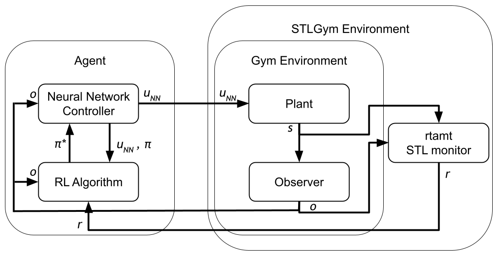

# stl-gym
A tool for modifying _Reinforcement Learning_ (RL) environments to incorporate _Signal Temporal Logic_ (STL) specifications in the reward function. It works by augmenting exisiting RL environments that follow the Gym API to replace their existing reward function with the robustness degree, a measure of of how well the STL specification(s) is/are satisfied. The figure below shows a representation of how this augmentation is done. 




Each loop executed in the figure above is referred to as a _timestep_ and is executed in the Gym API using the `.step()` function, which is used in the form
```Python
next_observation, reward, done, info = env.step(u_NN)
```
where `next_observation` is the output _o_ from the observer, `reward` is the ouput _r_ from _RTAMT_, `done` is a boolean indicator of whether the episode is over, and `info` is a dictionary with relevant information that is not necessarily used by the RL algorithm for learning, but might be important to know.


## CONFIG setup
A configuration file is required for creating an STL-gym environment. The path to the file is used as an input when initializing the environment as follows: 
```Python
import gym
from functools import partial
import stlgym

# For a single environment object
env = stlgym.make('path_to_config/config.yaml', env=None)

# For the function version required by some algorithms in order to run simulations in parallel
env_fn = partial(stlgym.make, 'path_to_config/config.yaml')
```

If the environment has already been made, it can be used as an input, but if left empty, must be specified in the config file. The major sections of the config file are explained below and an example is provided.

### ```env_name:```
If an environment object is not provided upon initialization, the registered name of the environment must be specified in the config file. For more information on registering a custom environment, we recommend reading the [OpenAI Gym](https://github.com/openai/gym) README.md file for more information.

### ```dense:```
This is a setting, whose options are ```True``` or ```False```, with ```False``` being the default. This setting allows users to switch between the dense or sparse definitions of the STL-based reward function. More details on how this impacts learning or evaluation can be found in the accompanying paper.

In short, if `dense: True`, then the robustness degree of the STL specifications is computed at every timestep. The dense version is more conducive to learning the desired behavior. However, the dense version is difficult to understand. If users use the default sparse version, the robustness degree is only computed at the end of an episode. This is really useful for understanding whether a specification was satisfied.

### ```constants:```
In this section of the configuration file, users define any constants used for defining their specifications. Constants require a name, type, and value. The name should match the name used in the specification.

### ```variables:```
In this section of the configuration file,  users define the environment variables that need to be recorded in order to evaluate the specifications. The recorded variable values will make up the multi-variate signal used in the robustness degree calculation. To define a variable, users must specify a `name`, the data `type` (`bool`, `int`, or `float`), `location`, and `identifier`. The name must match the name used in the specification. The location specifies how to access the variable in the environment. The location can be one of the following 3 options: 
1. __obs__: This option pulls the data from the output `next_observation` from the environment' `.step()` function. Provided the observation is a vector (we do not support dictionary observations yet), the `identifier` is the integer index that identifies the variable within the vector.
2. __info__: This option pulls the data from the `info` dictionary output by the `.step()` function. This is useful for accessing state data that isn't included in the observation, but could be crucial for defining _safe_ behavior. The `identifier` for this option is the dictionary key associated with the desired data. We do not support nested dictionaries at this time, but hope to include support in the future.
3. __state__: This option pulls from the environment's internal variables. The `identifier` is the variable name (e.g. `var_name`), which would record the value of `env.var_name` at each timestep. When possible, we recommend modifying the Gym environment so this information is included in the `info` output instead of accessing directly. 

### ```specifications:```


## Example: pendulum-v0

```yaml
env_name: Pendulum-v0
dense: True
constants:
    - name: T
      type: int
      value: 5
variables:
    - name: var_name1
      type: float
      location: obs
      identifier: int
    - name: var_name2
      type: float
      location: info
      identifier: key
specifications:
    - name: spec1
      descriptor: optional description
      spec: spec1 = always(eventually[0:5]((var_name1 <= T) and (var_name2 >= 3))
      weight: 0.6
    - name: spec2
      descriptor: optional description
      spec: spec2 = always((var_name2 >= 3) implies (eventually[0.5:1.5](var_name1 >= 3)))
    - name: spec3
      descriptor: optional description
      spec: spec3 = always(var_name2 > T)
```

## Installation
